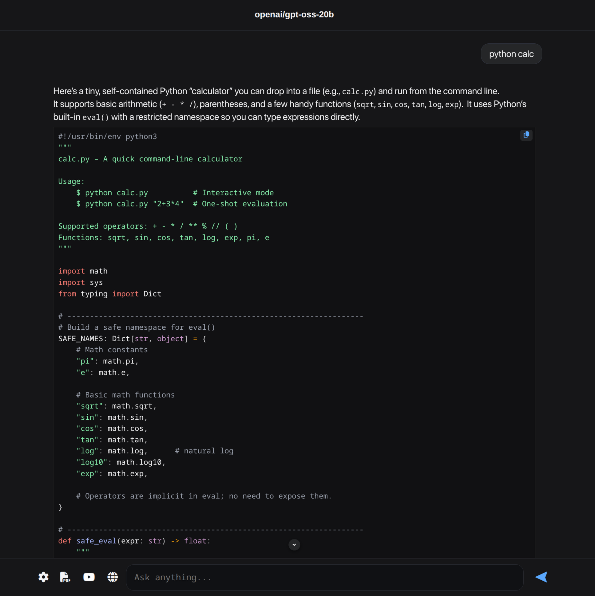

# lmstudio-webui
- this is experimental webui-chat alternative works with lm Studio
- ive made this ui because i didnt like openwebui(in term of websearch and other tools)
- it was easier for me to insert the tools(weather, websearch, etc...) content inside the user tasks

---

## Features

- **Streaming Chat** – Receive responses from LM Studio’s API at `http://localhost:1234`.
- **Web Search** – Perform text and image searches using a local SearXNG instance.
- **YouTube Transcripts** – Extract transcript text from YouTube videos (supports multiple languages).
- **PDF Extraction** – Upload PDFs and extract their text for use in the ui.
- **Weather Data** – Get forecasts, air quality, and UV index from Open-Meteo.
- **Custom Prompts** – Edit system prompts directly in the settings.

---

## Requirements

- **LM Studio** API enabled at `http://localhost:1234/v1` (CORS enabled)
- **Python 3.13+** (tested with 3.13.7)
- **SearXNG** local instance at `http://127.0.0.1:8888/search` (JSON enabled in `settings.yml`)

---

## Installation

### 1. Clone the Repository

```bash
git clone https://github.com/blasterprivate/lmstudio-webui.git
cd lmstudio-webui
````

### 2. Create and Activate a Virtual Environment

```bash
# Create virtual environment
python -m venv venv

# Activate
source venv/bin/activate
```

### 3. Install Dependencies

```bash
pip install -r requirements.txt
```

---

## How to Use

### 1. Start the Backend

```bash
python server.py
```

The backend will run at `http://0.0.0.0:5000`.

### 2. Start the Frontend

You can either open the HTML file directly in your browser or run a simple HTTP server:

```bash
python -m http.server 8000
```

Then open `http://localhost:8000` in your browser.

---

## Contributing

Contributions, bug reports, and feature requests are welcome.
Please open an issue or submit a pull request.
